<p align="center">
  <a href="https://prof.xxxjay123.xyz/"></a>
</p>

<p align="center">
  <a href="https://prof.xxxjay123.xyz/"></a>
  <a href="https://www.linkedin.com/in/xxxjay123"></a>
  <a href="https://prof.xxxjay123.xyz/assets/Jay-Cheng-CV.pdf"></a>
  <a href="mailto:jay6677884@gmail.com"></a>
</p>

### Accumulate. Wait. Grow.

I trade the Vegas tunnel, and I learn the same way: build a position one skill at a time, wait for the right entry, then let it compound.

Admin & IT Support by title, developer by habit. I build tools people use every week, run a multi-venue trading platform after hours, and work alongside AI agents every day. Next stop: IT and blockchain engineering.

| | |
|---|---|
| **Now** | Admin & IT Support · Hong Kong |
| **Building** | [Lyrithm](https://lyrithm.io) — quant trading across 7 perpetual venues, centralised and on-chain |
| **AI** | Claude Code · Codex · MCP · agent skills — built with AI, verified by me |
| **Learning** | Solidity · Foundry · smart-contract security |

### Highlights

- **Reconciliation engine** — 1,000+ records a month, from several days of manual work to under one day.
- **Lyrithm** — Java / Spring Boot engine driving Python strategy workers over gRPC, a Next.js dashboard, blue-green Docker deploys and OWASP-gated CI.
- **This website** — React, a Three.js voxel portrait built from my pixel logo, and scroll-driven storytelling. Source is [right here](./src).

### Open source

| Project | What it is | Stack |
|---|---|---|
| [hk-neon-frames](https://github.com/xxxJay123/hk-neon-frames) | Hong Kong neon sign frames for HTML, React and Vue | JavaScript · SVG |
| [remarkable-chinese-toolkit](https://github.com/xxxJay123/remarkable-chinese-toolkit) | Chinese fonts, input and handwriting for reMarkable tablets | C++ · QML |
| [ai-tools-beginner-guide](https://xxxjay123.github.io/ai-tools-beginner-guide/) | A bilingual guide to choosing AI tools | HTML · JS |
| [stock-trainer](https://stock-trainer-nine.vercel.app) | Trading simulator with a hand-built candlestick engine | React · Vite |
| [lyrithm-strategy-sdk](https://github.com/Lyrithm-io/lyrithm-strategy-sdk) | Apache-2.0 strategy SDK with a Pine Script runtime | Python |

### Stack

<p>
  
</p>


### Certification

- [Java & Spring Boot Enterprise Microservices Development — Venturenix LAB](https://drive.google.com/file/d/10tL_A8WlTC0od6T_uDsBXBJlbiLsp5tV/view)
- Certificate in Frontend Web Developer — ERB

<details>
<summary><b>About this repo</b></summary>

<br>

This repo is both my GitHub profile README and the source of my website — Vite, React, TypeScript, Three.js (React Three Fiber), Motion and Lenis.

```bash
npm install
npm run dev     # http://localhost:5173
npm run build   # type-check, then build to dist/
```

Live at [prof.xxxjay123.xyz](https://prof.xxxjay123.xyz) (Cloudflare Workers, `npm run deploy:cf`) and mirrored on GitHub Pages, which `.github/workflows/pages.yml` deploys on every push to `main`.

</details>
